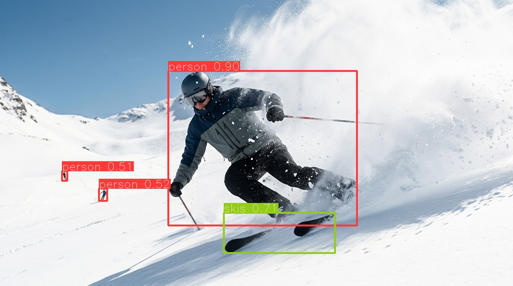
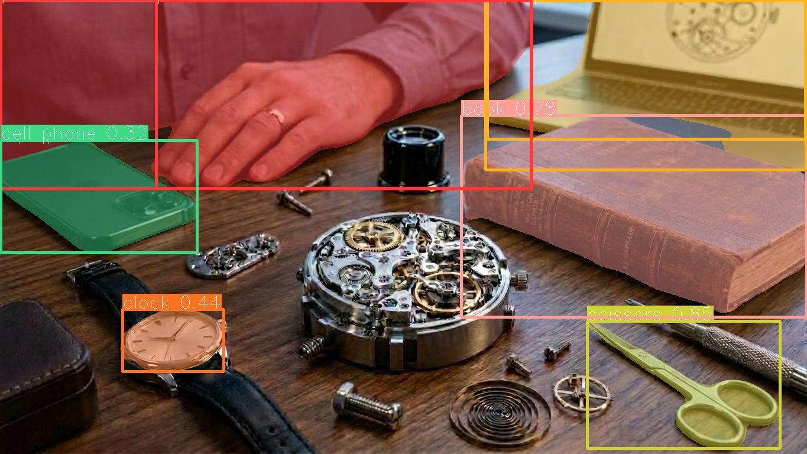

<p align="center">
  <picture>
    <source media="(prefers-color-scheme: dark)" srcset="docs/assets/brand/nitid-logo-on-dark.png">
    
  </picture>
</p>

<p align="center"><strong>One library. DETR made simple.</strong></p>

<p align="center">
  <a href="https://nitidio.github.io/nitid/"></a>
  <a href="LICENSE"></a>
  <a href="#installation"></a>
  <a href="https://colab.research.google.com/github/Nitidio/nitid/blob/main/examples/notebooks/01_inference.ipynb"></a>
</p>

Train, validate, export and run vision models. The code is released under the Apache License 2.0, so you
can ship it inside your own product without opening your code or paying for a
license.

_nitid_, from Latin _nitidus_: clear, transparent, precise.

**No AGPL, no surprises.**



<p align="center">
  <a href="#installation">Installation</a> ·
  <a href="#quick-start">Quick start</a> ·
  <a href="#verified-models">Models</a> ·
  <a href="#documentation">Documentation</a>
</p>

## Why nitid?

- **Edge first.** The models are designed to run at the edge, on the hardware
  next to your cameras, not only on a datacenter GPU or NPU.
- **Self-contained checkpoints.** Every checkpoint carries the config and the
  class names it needs to be reproduced and checked — one file per model.
- **Handles messy datasets.** COCO and YOLO layouts are read directly, with no
  conversion step, and the inconsistencies real datasets have are tolerated.
- **Export anywhere.** OpenVINO, ONNX, TorchScript and TensorRT, from the same
  checkpoint.

## One library, three tasks, five operations

Object detection, instance segmentation and semantic segmentation, through one
API: `predict`, `track`, `train`, `val` and `export`. The DETR family moves fast
— RT-DETR, D-FINE — and nitid brings the best DETR made easy, so getting
from your dataset to an exported model does not mean following every paper.

What comes with it:

- Python API and command line
- Automatic download of the official COCO checkpoints for detection and
  instance segmentation; semantic segmentation is fine-tuned on your own masks
- Fine-tuning and validation for boxes, masks and dense semantic maps
- ByteTrack, BoT-SORT, and OC-SORT tracking with persistent IDs and annotated
  video output

## What "open" means here

The nitid code is released under the [Apache License 2.0](LICENSE). You can use
it commercially, modify it, and ship it in closed products. The public datasets
used for pretraining keep their own terms: the official checkpoints listed in
[Verified models](#verified-models) are trained on COCO and Objects365.

## Installation

Requires Python 3.10, 3.11 or 3.12.

```bash
pip install nitid
```

Inference and export work out of the box. Other features are optional extras:

| Extra             | Adds                                                     |
| :---------------- | :------------------------------------------------------- |
| `train`           | Fine-tuning and COCO-style validation                    |
| `track`           | ByteTrack, BoT-SORT, and OC-SORT object tracking         |
| `openvino`        | OpenVINO export and runtime for Intel CPU, iGPU, and NPU |
| `wandb`, `mlflow` | Experiment tracking during training                      |

```bash
pip install "nitid[train,track]"
```

pip installs the default PyTorch build for your platform. If you need a
specific CUDA version, install PyTorch first following
[pytorch.org](https://pytorch.org/get-started/locally/), then install nitid.
TensorRT export has its own requirements; see [docs/export.md](docs/export.md#tensorrt).

## Quick Start

The canonical quickstart lives in [docs/quickstart.md](docs/quickstart.md); use the docs guide for the full walkthrough.

### Inference

```python
from nitid import NITID

model = NITID("model1s", task="detect")
results = model.predict("image.jpg", conf=0.5)
results[0].save("out.jpg")

# Export detections to Pandas DataFrame or crop bounding boxes
df = results[0].pandas()
results[0].crop(save_dir="crops/")
```

| Input | Detection |
| :---: | :-------: |
|  |  |

Generated with:

```bash
nitid predict model=model1m task=detect source=docs/assets/demo/source/ski.jpg conf=0.5 save=true
```

Instance segmentation uses the same API and downloads the matching COCO mask checkpoint:

```python
model = NITID("model1s", task="segment")
result = model.predict("image.jpg", conf=0.5)[0]
print(result.masks.data.shape)  # [N, H, W]
result.save("segmented.jpg")
```

| Input | Instance segmentation |
| :---: | :-------------------: |
|  |  |

Generated with:

```bash
nitid predict model=model1l task=segment source=docs/assets/demo/source/watchmaker.jpg conf=0.3 save=true
```

Semantic segmentation returns one class ID per pixel. There are no pretrained
semantic weights yet: `NITID("model1s", task="semantic")` is a starting point for
[fine-tuning](docs/fine_tuning.md), so predict with your fine-tuned checkpoint:

```python
model = NITID("semantic_best.pth", task="semantic")
result = model.predict("image.jpg", return_probs=True)[0]
print(result.semantic.mask.shape)  # [H, W]
result.save_semantic("class_ids.png")
```

### Training

```python
metrics = model.train(
    data="configs/datasets/my_dataset.yml",
    epochs=50,
    batch=8,
)
print(f"mAP50: {metrics['mAP50']:.4f}, mAP50-95: {metrics['mAP50-95']:.4f}")
```

See [fine-tuning](docs/fine_tuning.md) for COCO, YOLO, and semantic-mask dataset formats.

### Tracking

```python
for result in model.track("video.mp4", conf=0.5, stream=True, save=True):
    if result.boxes.id is not None:
        track_ids = result.boxes.id
```

<p align="center">
  
</p>

_`model1s` detection with ByteTrack and `vid_stride=2` on a CC0 street video._

The annotated video is saved under `runs/track/exp/`. Tracking dependencies
are optional; install them with `pip install "nitid[track]"`.

### Validation

```python
metrics = model.val(
    data="configs/datasets/my_dataset.yml",
    project="runs/val",
    name="exp",
)
# saves validation plots to runs/val/exp by default
```

### Export

```python
model.export(format="openvino")
model.export(format="onnx")
model.export(format="torchscript")
model.export(format="tensorrt")
```

| Deployment target | Hardware                              | Export format          | Extra install                                             |
| :---------------- | :------------------------------------ | :--------------------- | :-------------------------------------------------------- |
| **OpenVINO**      | Intel CPU, iGPU and NPU               | `format="openvino"`    | `pip install "nitid[openvino]"`                           |
| **ONNX**          | Any ONNX runtime (CPU, GPU)           | `format="onnx"`        | A runtime, e.g. `pip install onnxruntime`                 |
| **PyTorch**       | CPU, CUDA GPU                         | `.pth` checkpoint      | None                                                      |
| **TorchScript**   | LibTorch (C++)                        | `format="torchscript"` | None                                                      |
| **TensorRT**      | NVIDIA GPU (Jetson, RTX, data center) | `format="tensorrt"`    | `tensorrt>=8.6` (see [docs/export.md](docs/export.md#tensorrt)) |

Capture Python API output, environment details, and failure tracebacks in one
attachable log:

```python
from nitid import NITID, bugreport

with bugreport("prediction") as report:
    model = NITID("model1s", task="detect")
    model.predict("image.jpg")

print(report.path)
```

### Command Line Interface

```bash
nitid predict model=model1s task=detect source=image.jpg
nitid predict model=semantic_best.pth task=semantic source=image.jpg save=true
nitid track model=model1s source=video.mp4 conf=0.5 save=true
nitid train model=model1s task=detect data=my_dataset.yml epochs=50
nitid val model=model1s task=detect data=my_dataset.yml
nitid export model=model1s task=detect format=onnx
nitid predict model=model1s source=image.jpg --report
nitid bugreport
```

For the full guide:

- Full quickstart: [docs/quickstart.md](docs/quickstart.md)
- Notebooks and scripts: [examples/](examples/README.md)
- Fine-tuning and validation: [docs/fine_tuning.md](docs/fine_tuning.md)
- Export: [docs/export.md](docs/export.md)
- Deployment: [docs/deployment.md](docs/deployment.md)
- CLI: [docs/cli.md](docs/cli.md)

## Migrating from YOLO & Compatibility

If you are coming from a YOLO codebase, the quickstart has a side-by-side
mapping of the API and the behaviour that differs:
[Coming from YOLO](docs/quickstart.md#coming-from-yolo).

## Verified models

> 💡 `NITID("model1s", task=...)` is the canonical constructor. The trailing size letter selects the model size, and `model1` identifies the model generation. Supported tasks are `detect`, `segment`, and `semantic`.

### Object Detection (`task="detect"`)

_Evaluated on COCO val2017 at 640x640 resolution._

| Model Alias | Architecture | COCO mAP<sup>50-95</sup> _(vs YOLO11)_ | Speed<sup>T4 TRT10 FP16</sup> _(vs YOLO11)_ | Params | FLOPs |                                                    Config                                                    |                                       Official Checkpoint                                        |
| :---------- | :----------- | :------------------------------------: | :-----------------------------------------: | :----: | :---: | :----------------------------------------------------------------------------------------------------------: | :----------------------------------------------------------------------------------------------: |
| `model1n`\* | **D-FINE-N** |           **42.8** _(40.9)_            |           **2.12 ms** _(1.70 ms)_           |  4.0M  |  7B   |        [yml](https://github.com/Peterande/D-FINE/blob/master/configs/dfine/dfine_hgnetv2_n_coco.yml)         |     [pth](https://github.com/Peterande/storage/releases/download/dfinev1.0/dfine_n_coco.pth)     |
| `model1s`   | **D-FINE-S** |           **50.7** _(48.6)_            |           **3.49 ms** _(2.50 ms)_           | 10.0M  |  25B  | [yml](https://github.com/Peterande/D-FINE/blob/master/configs/dfine/objects365/dfine_hgnetv2_s_obj2coco.yml) |   [pth](https://github.com/Peterande/storage/releases/download/dfinev1.0/dfine_s_obj2coco.pth)   |
| `model1m`   | **D-FINE-M** |           **55.1** _(53.1)_            |           **5.62 ms** _(4.70 ms)_           | 19.0M  |  57B  | [yml](https://github.com/Peterande/D-FINE/blob/master/configs/dfine/objects365/dfine_hgnetv2_m_obj2coco.yml) |   [pth](https://github.com/Peterande/storage/releases/download/dfinev1.0/dfine_m_obj2coco.pth)   |
| `model1l`   | **D-FINE-L** |           **57.3** _(55.0)_            |           **8.07 ms** _(6.20 ms)_           | 31.0M  |  91B  | [yml](https://github.com/Peterande/D-FINE/blob/master/configs/dfine/objects365/dfine_hgnetv2_l_obj2coco.yml) | [pth](https://github.com/Peterande/storage/releases/download/dfinev1.0/dfine_l_obj2coco_e25.pth) |
| `model1x`   | **D-FINE-X** |           **59.3** _(57.5)_            |          **12.89 ms** _(11.80 ms)_          | 62.0M  | 202B  | [yml](https://github.com/Peterande/D-FINE/blob/master/configs/dfine/objects365/dfine_hgnetv2_x_obj2coco.yml) |   [pth](https://github.com/Peterande/storage/releases/download/dfinev1.0/dfine_x_obj2coco.pth)   |

_Numbers in parentheses correspond to the equivalent YOLO11 model (YOLO11n/s/m/l/x) for quick reference._  
_\* Official checkpoints for `model1s/m/l/x` download automatically upon first use. `model1n` detection requires a checkpoint path or custom weights._

### Instance Segmentation (`task="segment"`)

_Based on D-FINE-seg. Published in the official [D-FINE-seg model repository](https://huggingface.co/ArgoSA/D-FINE-seg). Official checkpoints download automatically upon first use._

| Model Alias | Architecture     |  Backing Checkpoint   |                                 Weights                                  |
| :---------- | :--------------- | :-------------------: | :----------------------------------------------------------------------: |
| `model1n`   | **D-FINE-Seg-N** | `dfine_seg_n_coco.pt` | [Auto-download / Hugging Face](https://huggingface.co/ArgoSA/D-FINE-seg) |
| `model1s`   | **D-FINE-Seg-S** | `dfine_seg_s_coco.pt` | [Auto-download / Hugging Face](https://huggingface.co/ArgoSA/D-FINE-seg) |
| `model1m`   | **D-FINE-Seg-M** | `dfine_seg_m_coco.pt` | [Auto-download / Hugging Face](https://huggingface.co/ArgoSA/D-FINE-seg) |
| `model1l`   | **D-FINE-Seg-L** | `dfine_seg_l_coco.pt` | [Auto-download / Hugging Face](https://huggingface.co/ArgoSA/D-FINE-seg) |
| `model1x`   | **D-FINE-Seg-X** | `dfine_seg_x_coco.pt` | [Auto-download / Hugging Face](https://huggingface.co/ArgoSA/D-FINE-seg) |

### Semantic Segmentation (`task="semantic"`)

There are no pretrained semantic checkpoints. `NITID("model1s", task="semantic")` starts
from the instance-segmentation checkpoint of the same size and is meant for
[fine-tuning](docs/fine_tuning.md) on your own masks.

## Documentation

| Doc                                                          | Description                                                             |
| ------------------------------------------------------------ | ----------------------------------------------------------------------- |
| [docs/quickstart.md](docs/quickstart.md)                     | Full quickstart                                                         |
| [examples/](examples/README.md)                              | Notebooks (Colab) and runnable scripts                                  |
| [docs/fine_tuning.md](docs/fine_tuning.md)                   | Training, validation, AMP, EMA, dataset formats                         |
| [docs/export.md](docs/export.md)                             | OpenVINO, ONNX, TorchScript, and TensorRT export                        |
| [docs/deployment.md](docs/deployment.md)                     | Running exported models with ONNX Runtime, OpenVINO, LibTorch, Triton   |
| [docs/training_cuda_openvino.md](docs/training_cuda_openvino.md) | End-to-end run on an NVIDIA GPU or an Intel machine with OpenVINO |
| [docs/cli.md](docs/cli.md)                                   | Command-line reference                                                  |
| [docs/api_reference.md](docs/api_reference.md)               | Full Python API reference                                               |
| [docs/troubleshooting.md](docs/troubleshooting.md)           | FAQ and fixes for common install, model, Docker, CUDA, and CLI problems |
| [docs/macos_docker_setup.md](docs/macos_docker_setup.md)     | macOS / Apple Silicon development environment with Docker               |
| [docs/brand.md](docs/brand.md)                               | Brand: logo, palette, typography, and what the project announces        |

## Development

Everything above is for using nitid. To work on nitid itself, use a source
checkout and [uv](https://github.com/astral-sh/uv), which installs the exact
dependency versions pinned in `uv.lock` — including CUDA 12.1 PyTorch wheels on
Linux and Windows.

```bash
git clone https://github.com/Nitidio/nitid.git && cd nitid
uv sync --extra dev --extra train
```

Inside the checkout, run the CLI and tools through the project environment:

```bash
uv run nitid predict model=model1s task=detect source=image.jpg

# Unit tests (no GPU, no checkpoint needed)
uv run pytest tests/unit

# All tests (integration tests build a tiny checkpoint automatically)
uv run pytest

# Lint and format
uv run ruff check .
uv run ruff format --check .

# Type-check
uv run mypy dfine tools
```

Integration tests use a session-scoped fixture in `tests/conftest.py` that
builds a small D-FINE-S model with random weights at test time — no download
required.

- [docs/onboarding.md](docs/onboarding.md) — **start here if you're new to the
  codebase**: architecture, conventions, gotchas
- [CONTRIBUTING.md](CONTRIBUTING.md) — branch workflow, commit conventions, and
  the PR checklist

### Docker Environment

For developers on macOS (Apple Silicon) or environments needing isolated Linux containers, a preconfigured `Dockerfile` and `docker-compose.yml` are provided:

```bash
docker compose run --rm nitid-dev
```

See [macOS Docker Setup](docs/macos_docker_setup.md) for the setup guide.

## Acknowledgements & Citation

nitid contains code derived from [D-FINE](https://github.com/Peterande/D-FINE) and [D-FINE-seg](https://github.com/ArgoHA/D-FINE-seg), with smaller portions from RT-DETR, DETR and PaddleDetection. See [THIRD_PARTY_NOTICES.md](THIRD_PARTY_NOTICES.md) and the [Apache 2.0 License](LICENSE).

If you use nitid in your research or product, please cite:

```bibtex
@software{nitid2026,
  title={nitid: Real-Time Open Source Computer Vision},
  author={{Vaelsys}},
  year={2026},
  url={https://github.com/Nitidio/nitid}
}

@article{peng2024dfine,
  title={D-FINE: Redefine Regression Task in DETRs as Fine-grained Distribution Refinement},
  author={Peng, Yansong and Shi, Hongtao and Li, Shiyu and Wang, Yan and Li, Hongbin and Liu, Guozheng and Li, Bing and Hu, Weiming},
  journal={arXiv preprint arXiv:2410.13842},
  year={2024}
}

@article{saakyan2026dfineseg,
  title={D-FINE-seg: Object Detection and Instance Segmentation Framework with multi-backend deployment},
  author={Saakyan, Argo and Solntsev, Dmitry},
  journal={arXiv preprint arXiv:2602.23043},
  year={2026}
}
```
